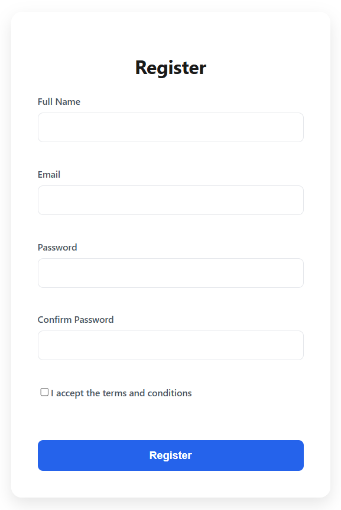
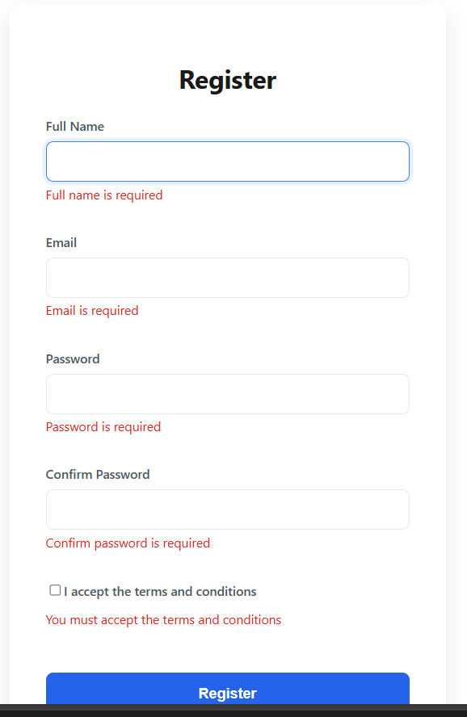
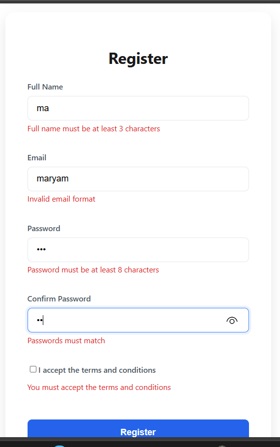
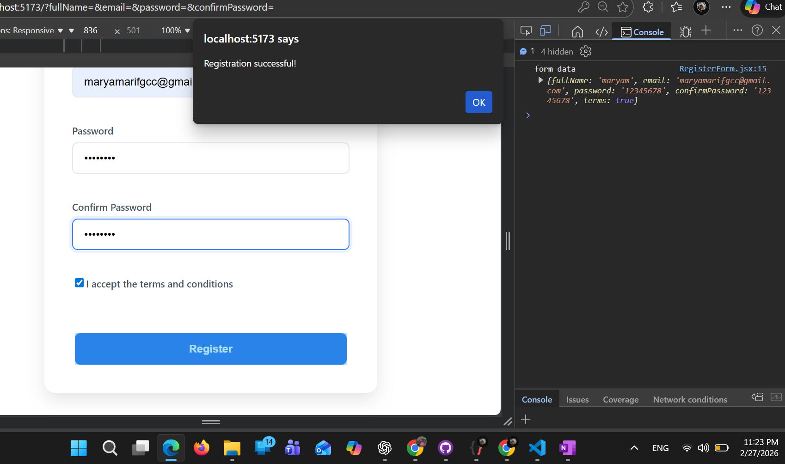

# register-form-react

Goal: Build a simple Register Form using React Hook Form and Yup validation.

# Structure of project

📂 src
📂 validations
🗄️registerSchema.js
📂 Components
🗄️ RegisterForm
🗄️ App.jsx
🗄️ main.jsx
🗄️ indix.css

# Behavior

Use React Hook Form to manage the form.
Use Yup for validation (with a resolver).
Show an error message under each field when invalid.
On successful submit:
console.log() the form data
Show a simple message: "Registration Successful!"

# Screenshots

